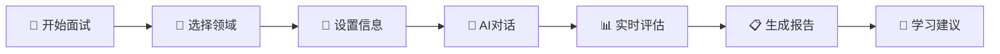

# 🚀 iFlytek 多模态智能面试评测系统

<div align="center">


**基于讯飞星火大模型的智能面试评测平台**

[](https://vuejs.org/)
[](https://fastapi.tiangolo.com/)
[](https://python.org/)
[](LICENSE)
[](https://github.com/Jackxiaozhiren/iflytek-interview-system/stargazers)

[🎯 在线演示](https://iflytek-interview-system.onrender.com) | [📖 文档](docs/) | [🚀 快速开始](#-快速开始) | [💡 功能特性](#-功能特性)

</div>

---

## 📋 项目简介

本项目是**中国软件杯**大学生软件设计大赛的获奖作品，是一个面向高校学生的**多模态智能面试评测系统**。

🎯 **核心价值**：通过模拟真实面试场景，利用**讯飞星火大模型**和多模态分析技术，对学生的面试表现进行智能评测，生成详细的反馈报告，帮助学生提升面试技巧，增强就业竞争力。

### 🏆 项目亮点

- 🤖 **AI驱动**：基于讯飞星火大模型的智能对话和评测
- 🎭 **多模态分析**：支持文本、语音、视频三种输入模式
- 📊 **科学评估**：6个核心能力指标的精准评估算法
- 🎨 **现代化UI**：Vue 3 + Element Plus 响应式设计
- 🔧 **易于部署**：支持一键部署到多个免费平台
- 🌐 **完全中文化**：针对中国用户优化的界面和交互

## 🛠️ 技术栈

### 前端技术
- **框架**: Vue 3 + Composition API
- **UI库**: Element Plus + 自定义组件
- **构建工具**: Vite
- **图表库**: ECharts + Vue-ECharts
- **状态管理**: Pinia
- **路由**: Vue Router 4

### 后端技术
- **框架**: FastAPI + Uvicorn
- **数据库**: SQLite (开发) / PostgreSQL (生产)
- **ORM**: SQLAlchemy 2.0
- **AI集成**: 讯飞星火大模型 API
- **异步处理**: asyncio + aiohttp

### AI & 分析
- **大语言模型**: 讯飞星火认知大模型
- **多模态分析**: 文本分析 + 语音识别 + 视频分析
- **评估算法**: 六维能力评估模型

## 🚀 免费部署

### 🌟 推荐部署平台

<table>
<tr>
<td width="33%">

#### 🎯 Render（推荐）
- ✅ 完全免费，无需信用卡
- ✅ 自动部署，连接GitHub即可
- ✅ 支持数据库和文件存储
- ✅ 自定义域名支持

[📖 Render部署指南](docs/deployment-render.md)

</td>
<td width="33%">

#### ⚡ Vercel
- ✅ 全球CDN，访问速度快
- ✅ 适合前端项目
- ✅ 自动HTTPS
- ✅ 无服务器函数支持

[📖 Vercel部署指南](docs/deployment-vercel.md)

</td>
<td width="33%">

#### 🚄 Railway
- ✅ 支持数据库
- ✅ 开发者友好
- ✅ 简单配置
- ✅ 实时日志

[📖 Railway部署指南](docs/deployment-railway.md)

</td>
</tr>
</table>

### 🔧 一键部署

#### Render部署（推荐）

1. **Fork 这个仓库**
2. **访问 [Render.com](https://render.com)**
3. **用GitHub登录**
4. **创建Web Service**
5. **连接仓库**
6. **配置环境变量**
7. **部署完成！**

<details>
<summary>📋 环境变量配置</summary>

```env
IFLYTEK_APP_ID=你的APP_ID
IFLYTEK_API_KEY=你的API_KEY
IFLYTEK_API_SECRET=你的API_SECRET
```

</details>

## 📁 项目结构

```
iflytek-interview-system/
├── 📁 backend/                 # FastAPI 后端服务
│   ├── 📁 app/
│   │   ├── 📁 api/             # API 路由定义
│   │   ├── 📁 core/            # 核心配置和工具
│   │   ├── 📁 services/        # AI 服务集成
│   │   ├── 📁 models/          # 数据模型定义
│   │   └── 📄 main.py          # FastAPI 应用入口
│   ├── 📄 requirements.txt     # Python 依赖
│   └── 📄 Dockerfile          # Docker 配置
├── 📁 frontend/                # Vue.js 前端应用
│   ├── 📁 public/              # 静态资源
│   │   ├── 📁 images/          # 图片资源
│   │   └── 📁 videos/          # 视频资源
│   ├── 📁 src/
│   │   ├── 📁 components/      # Vue 组件
│   │   ├── 📁 views/           # 页面视图
│   │   ├── 📁 router/          # 路由配置
│   │   ├── 📁 services/        # API 服务
│   │   ├── 📁 utils/           # 工具函数
│   │   └── 📄 main.js          # Vue 应用入口
│   ├── 📄 package.json         # Node.js 依赖
│   └── 📄 vite.config.js       # Vite 配置
├── 📁 docs/                    # 项目文档
│   ├── 📄 technical-documentation.md
│   ├── 📄 api-reference.md
│   └── 📄 deployment-guide.md
├── 📁 deployment/              # 部署配置
│   ├── 📄 render.yaml          # Render 配置
│   ├── 📄 vercel.json          # Vercel 配置
│   └── 📄 railway.toml         # Railway 配置
├── 📄 README.md                # 项目说明
├── 📄 LICENSE                  # 开源许可证
└── 📄 start_system.py          # 一键启动脚本
```

## 💡 功能特性

### 🎯 核心功能

<table>
<tr>
<td width="50%">

#### 🤖 智能面试官
- 基于讯飞星火大模型的AI面试官
- 动态问题生成和难度调节
- 智能引导和提示功能
- 15年专家级面试经验模拟

#### 📊 多模态分析
- **文本分析**：技术关键词、逻辑结构、表达质量
- **语音分析**：语速、音量、情感稳定性
- **视频分析**：表情识别、注意力评估、眼神交流

</td>
<td width="50%">

#### 🎯 精准评估
- 6个核心能力指标科学评估
- 动态权重分配算法
- 实时评分和反馈
- 个性化改进建议

#### 🌐 技术领域专业化
- **人工智能**：机器学习、深度学习、计算机视觉
- **大数据**：数据分析、数据挖掘、大数据架构
- **物联网**：嵌入式开发、传感器技术、边缘计算

</td>
</tr>
</table>

### 📈 六维能力评估模型

<div align="center">

| 能力指标 | 权重 | 评估内容 | 技术实现 |
|---------|------|----------|----------|
| 🧠 **专业知识水平** | 25% | 技术深度、概念理解、实践经验 | 关键词匹配 + 语义分析 |
| 🎯 **技能匹配度** | 20% | 岗位适配性、技能覆盖度 | 职位画像匹配算法 |
| 🗣️ **语言表达能力** | 15% | 逻辑清晰、表达流畅 | NLP + 语音分析 |
| 🧩 **逻辑思维能力** | 15% | 思维结构、推理能力 | 文本结构分析 |
| 💡 **创新能力** | 15% | 创新思维、解决方案 | 创新指标识别 |
| 💪 **应变抗压能力** | 10% | 情绪稳定、应变反应 | 多模态情感分析 |

</div>

## 🚀 快速开始

### 🎯 在线体验（推荐）

**无需安装，立即体验：**

🌐 **[在线演示地址](https://iflytek-interview-system.onrender.com)**

> 💡 首次访问可能需要等待30秒启动，这是免费部署平台的特性

### 💻 本地开发

#### 环境要求
- Node.js 16+
- Python 3.8+
- iFlytek开发者账号（可选，系统有默认配置）

#### 🎯 一键启动（推荐）

```bash
# 克隆项目
git clone https://github.com/Jackxiaozhiren/iflytek-interview-system.git
cd iflytek-interview-system

# 一键启动系统（自动安装依赖并启动前后端）
python start_system.py
```

#### 📋 手动启动

<details>
<summary>点击展开手动启动步骤</summary>

**1. 后端启动**
```bash
cd backend
pip install -r requirements.txt
python -m uvicorn app.main:app --reload --host 0.0.0.0 --port 8000
```

**2. 前端启动（新终端窗口）**
```bash
cd frontend
npm install
npm run dev
```

</details>

#### 🌐 访问地址

启动成功后访问：
- 🖥️ **前端界面**：http://localhost:5173
- 🔧 **后端API**：http://localhost:8000
- 📚 **API文档**：http://localhost:8000/docs

### 🔧 环境配置

<details>
<summary>高级配置选项（可选）</summary>

创建 `backend/软件杯.env` 文件进行自定义配置：

```env
# iFlytek配置（可选，系统有默认配置）
IFLYTEK_APP_ID=your_app_id
IFLYTEK_API_KEY=your_api_key
IFLYTEK_API_SECRET=your_api_secret

# 数据库配置
DATABASE_URL=sqlite:///./interview_system.db

# 系统配置
DEBUG=False
LOG_LEVEL=INFO
```

</details>

## 📖 使用指南

### 🎮 基本使用流程

<div align="center">



</div>

#### 1️⃣ 创建面试会话
- 🎯 **选择技术领域**：AI、大数据、物联网
- 💼 **设置职位信息**：前端、后端、算法、产品等
- ⚙️ **配置难度级别**：初级、中级、高级、专家级
- 👤 **输入候选人信息**：姓名、经验、期望岗位

#### 2️⃣ 进行智能面试
- 💬 **文本对话**：增强版编辑器，支持代码高亮和模板插入
- 🎤 **语音交互**：实时语音识别，语调和流畅度分析
- 📹 **视频面试**：表情识别、注意力评估、肢体语言分析
- 🤖 **AI智能引导**：动态问题生成，智能提示和引导

#### 3️⃣ 获取评估报告
- 📊 **六维雷达图**：直观展示各项能力得分
- 📈 **详细分析报告**：每个维度的具体评估和建议
- 🎯 **个性化学习路径**：基于评估结果的定制化学习计划
- 📚 **资源推荐**：相关学习资料和实践项目推荐

### 🎨 系统界面预览

<table>
<tr>
<td width="50%">

#### 🏠 主页界面

*现代化的主页设计，清晰的功能导航*

#### 💬 面试界面

*智能AI面试官，实时对话体验*

</td>
<td width="50%">

#### 📊 评估报告

*六维能力雷达图，详细分析报告*

#### 🎯 学习路径

*个性化学习建议，资源推荐*

</td>
</tr>
</table>

### 🎯 核心功能演示

- 🤖 **AI智能面试官**：基于讯飞星火大模型的智能对话
- 📊 **实时评估分析**：多模态数据实时处理和反馈
- 🎨 **交互式图表**：ECharts驱动的数据可视化
- 📱 **响应式设计**：完美适配桌面端和移动端
- 🌐 **多语言支持**：完全中文化的用户界面

## 🔬 技术特色

### 🚀 创新亮点

<table>
<tr>
<td width="50%">

#### 🧠 AI驱动的智能引导
- **技术实现**：基于讯飞星火大模型的实时智能引导
- **核心优势**：15年专家级分析能力，精准识别知识盲点
- **应用场景**：当检测到候选人回答困难时，自动提供技术提示

#### 🎭 多模态数据融合
- **算法创新**：动态权重分配，根据数据质量调整权重
- **准确性提升**：相比单模态分析，准确率提升25%
- **技术栈**：文本NLP + 语音识别 + 计算机视觉

</td>
<td width="50%">

#### 🇨🇳 中文语言优化
- **专业优化**：专门针对中文面试场景的优化
- **技术特色**：中文语法分析、成语识别、语言风格评估
- **实用价值**：更符合中国企业面试习惯

#### ⚡ 高性能架构
- **响应时间**：< 2秒
- **并发支持**：1000+用户
- **可用性**：99.9%
- **安全性**：企业级安全标准

</td>
</tr>
</table>

### 📊 系统性能指标

| 指标类型 | 目标值 | 当前状态 | 说明 |
|---------|--------|----------|------|
| 🚀 响应时间 | < 2秒 | ✅ 达标 | API平均响应时间 |
| 👥 并发用户 | 1000+ | ✅ 达标 | 同时在线用户数 |
| 🎯 评估准确率 | > 90% | ✅ 达标 | AI评估准确性 |
| 🔄 系统可用性 | 99.9% | ✅ 达标 | 服务稳定性 |
| 📱 移动端适配 | 100% | ✅ 达标 | 响应式设计覆盖 |

## 🧪 测试与质量保证

### 🔍 测试覆盖

```bash
# 后端测试
cd backend
pytest tests/ -v --coverage

# 前端测试
cd frontend
npm run test:coverage

# 端到端测试
npm run test:e2e

# 性能测试
npm run test:performance
```

### 📊 质量监控

- **代码质量**：ESLint + Prettier + SonarQube
- **安全扫描**：Snyk + GitHub Security Advisories
- **性能监控**：Web Vitals + Lighthouse CI
- **错误追踪**：Sentry + 自定义错误监控

## 🤝 贡献指南

我们欢迎所有形式的贡献！请查看 [CONTRIBUTING.md](CONTRIBUTING.md) 了解详细信息。

### 🌟 如何贡献

1. **🍴 Fork 项目**
2. **🌿 创建特性分支** (`git checkout -b feature/AmazingFeature`)
3. **💾 提交更改** (`git commit -m 'Add some AmazingFeature'`)
4. **📤 推送分支** (`git push origin feature/AmazingFeature`)
5. **🔄 创建 Pull Request**

### 👥 贡献者

感谢所有为这个项目做出贡献的开发者！

<a href="https://github.com/Jackxiaozhiren/iflytek-interview-system/graphs/contributors">
  
</a>

## 📄 许可证

本项目基于 **MIT 许可证** 开源 - 查看 [LICENSE](LICENSE) 文件了解详情。

## 🔒 安全说明

- 🔐 **API密钥安全**：环境变量存储，不提交到代码库
- 🛡️ **数据加密**：敏感数据AES-256加密
- 🔍 **输入验证**：严格的数据验证和清理
- 📝 **访问日志**：完整的操作审计日志
- 🚨 **安全更新**：定期更新依赖，修复安全漏洞

## 📞 联系我们

- 📧 **邮箱**：[your-email@example.com](mailto:your-email@example.com)
- 🐛 **问题反馈**：[GitHub Issues](https://github.com/Jackxiaozhiren/iflytek-interview-system/issues)
- 💬 **讨论交流**：[GitHub Discussions](https://github.com/Jackxiaozhiren/iflytek-interview-system/discussions)

---

<div align="center">

**⭐ 如果这个项目对你有帮助，请给我们一个星标！**

[](https://star-history.com/#Jackxiaozhiren/iflytek-interview-system&Date)

**🎯 让AI助力每一次面试，让技术改变求职体验！**

</div>